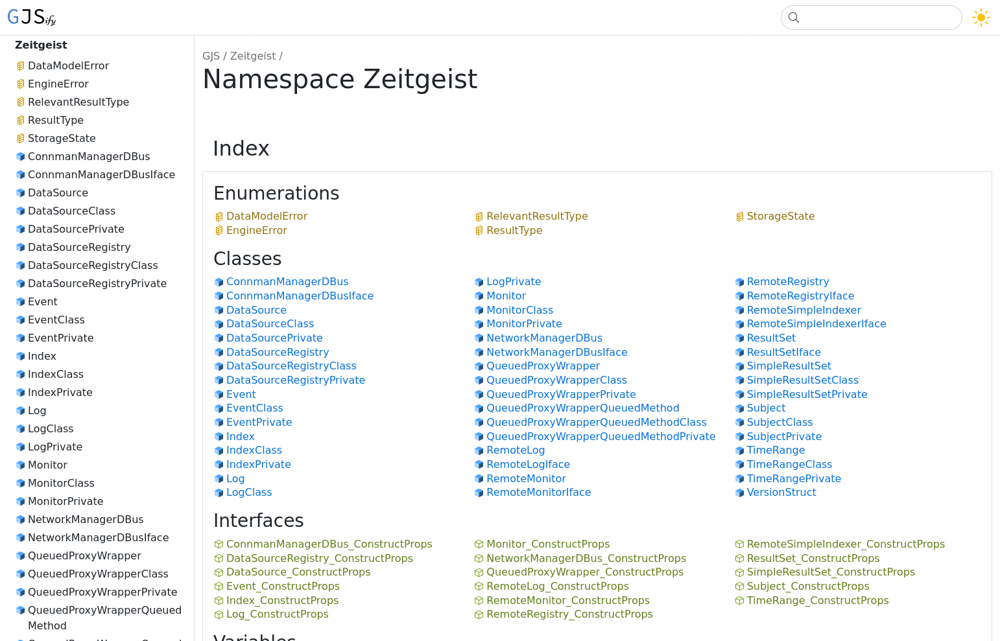

# TypeDoc Gjsify Theme

A compatible [TypeDoc](https://github.com/TypeStrong/typedoc) theme build for [Gjsify](https://gjs-docs.gjsify.org/).

[](https://gjs-docs.gjsify.org/)

## Install

```bash
npm install @gjsify/typedoc-plugin-remote-search @gjsify/typedoc-theme --save-dev
```

## Usage

```bash
typedoc --plugin @gjsify/typedoc-plugin-remote-search --theme gjsify --out docs src/index.ts
# Wait until documentation generation is done
typedoc-server serve ./doc
```

# Development

This theme was developed specifically for the requirements of Gjsify, if there is a need we are happy to extend the theme for general use. For example with options to replace the logo. We therefore also gladly accept pull requests, but this is not a must, you are also welcome to just fork the theme to fit your own needs.

This package contains everything needed to build the theme for Typedoc, but the client side javascript code is developed in a separate package called [@gjsify/typedoc-theme-client](https://github.com/gjsify/doc/tree/main/packages/typedoc-theme-client).